# BITZZ PHONE - Premium Apple Reseller E-Commerce

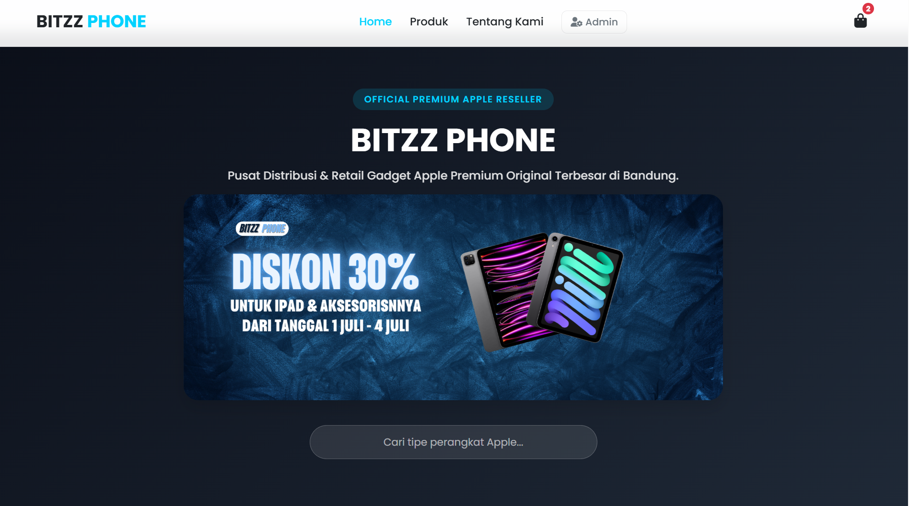

BITZZ PHONE adalah aplikasi web e-commerce *front-end* yang berfokus pada penjualan produk-produk Apple (iPhone, MacBook, dan iPad). Proyek ini dibangun menggunakan HTML, CSS, dan JavaScript murni (Vanilla) dengan memanfaatkan `localStorage` sebagai simulasi *database* untuk manajemen status keranjang belanja, inventori produk, dan autentikasi sederhana.

---

## 📸 Antarmuka dan Fitur Utama

Berikut adalah rincian fungsionalitas dari setiap bagian pada website BITZZ PHONE:

### 1. Header & Navigasi Utama
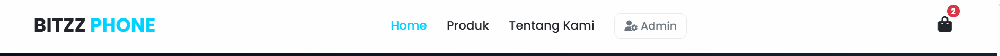
Bagian atas website (Header) dirancang agar responsif dan memudahkan pengguna untuk berpindah halaman. Terdapat menu:
* **Home:** Kembali ke halaman utama.
* **Produk:** Mengarahkan pengguna langsung ke bagian katalog produk.
* **Tentang Kami:** Berisi informasi singkat mengenai toko BITZZ PHONE.
* **Keranjang (Ikon Tas):** Menampilkan jumlah barang yang sedang ingin dibeli (dilengkapi *badge* angka dinamis).
* **Admin:** Tombol khusus untuk masuk ke portal manajemen stok.
* **Search Bar:** Fitur pencarian *real-time* untuk mencari nama produk dengan cepat.

### 2. Banner Promosi (Hero Section)
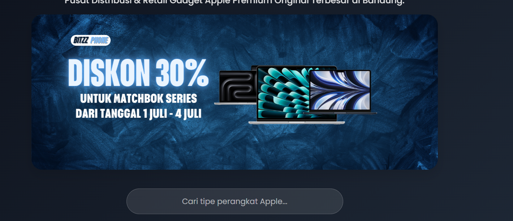
Bagian sambutan pertama kali (*Hero Banner*) yang dirancang visual untuk menarik perhatian pelanggan.
* **Visual Menarik:** Menampilkan gambar produk unggulan atau promo terbaru dengan tata letak yang profesional.
* **Call-to-Action (CTA):** Tombol yang mengarahkan pengguna langsung ke area katalog belanja agar alur transaksi menjadi lebih cepat.

### 3. Katalog Produk (Product Showcase)
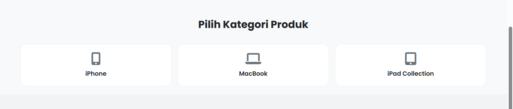
Menampilkan seluruh lini produk yang dijual, dikategorikan secara rapi (iPhone, MacBook, iPad).
* **Tampilan Kartu (Card):** Setiap produk ditampilkan dalam bentuk kartu berisi foto produk, nama, dan harga dasar (*start from*).
* **Sistem Katalog Dinamis:** Menampilkan seluruh lini produk (dari seri reguler hingga Pro Max) tanpa ada yang terpotong.

### 4. Detail Produk & Pemilihan Varian (Checkout Area)
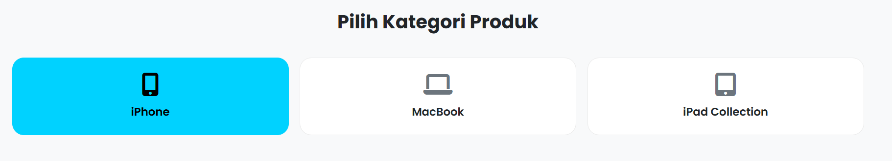
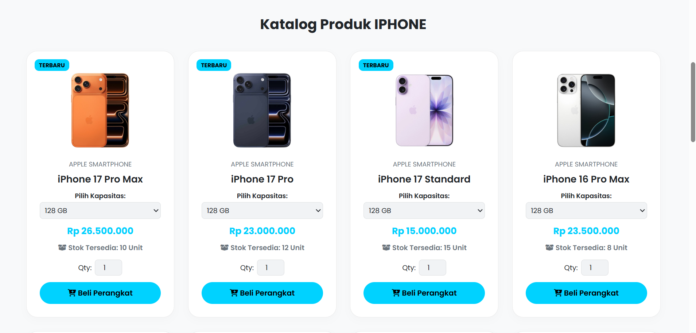
Fitur interaktif tempat pelanggan menyesuaikan spesifikasi barang sebelum memasukkannya ke keranjang.
* **Pilihan Kapasitas (Gigabyte/Terabyte):**
* 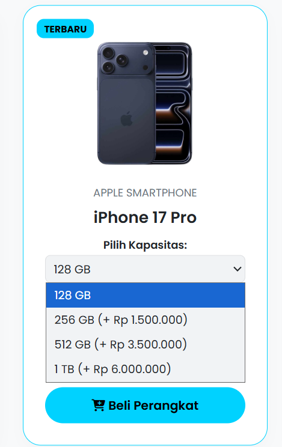
*  Tersedia opsi *storage* seperti 128GB, 256GB, 512GB, hingga 1TB. Pengguna wajib memilih salah satu sebelum membeli.
* **Harga Otomatis (Dynamic Pricing):** Ketika pelanggan mengklik opsi kapasitas yang berbeda, harga produk di layar akan langsung berubah menyesuaikan harga varian tersebut.
* **Pemilihan Kuantitas:** Pelanggan dapat mengatur berapa banyak unit yang ingin dibeli untuk varian tersebut melalui fitur kuantitas (*quantity selector*).
* **Tombol "Beli":** Tombol utama untuk mengeksekusi pesanan. Sistem akan mengecek ketersediaan stok; jika stok habis, tombol tidak bisa ditekan.

### 5. Keranjang Belanja & Checkout (WhatsApp Integration)
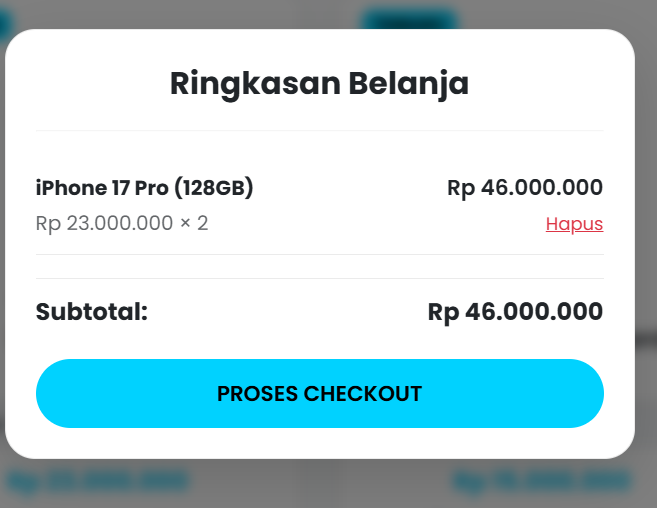
Alur penyelesaian belanja yang efisien dan langsung terhubung dengan admin toko.
* **Manajemen Keranjang:** Menampilkan rincian barang, varian GB yang dipilih, jumlah unit, dan kalkulasi subtotal.
* **Moto Toko:** Pada bagian *checkout*, informasi pembayaran digantikan dengan penempatan Moto Toko BITZZ PHONE untuk memperkuat *branding*.
* **Formulir Pengiriman:**
* 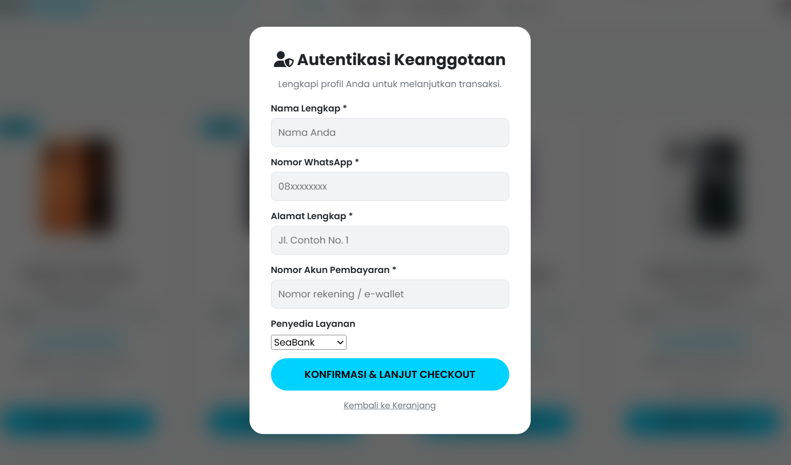
*  Pengguna mengisi data diri seperti nama, alamat, dan catatan khusus.
*   * **pemilihan pembayaran:**
    * * 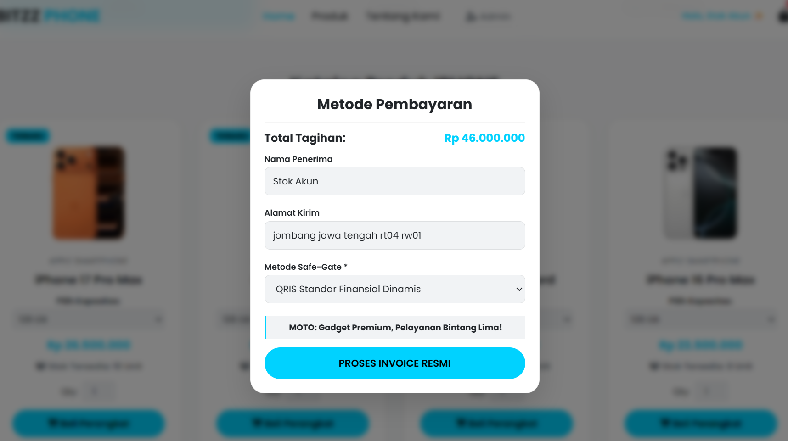
    * ada 3 pilihan qris sebank dan dana 
* **WhatsApp Redirect:**
** 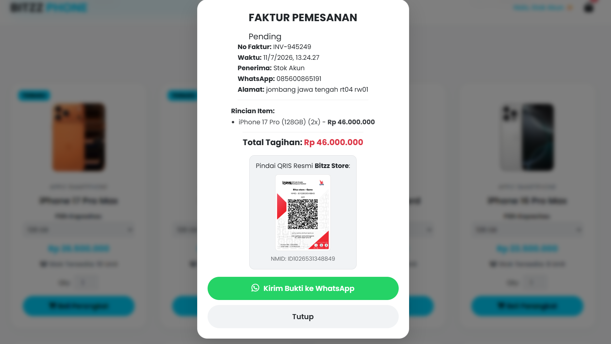
* Begitu proses selesai, sistem otomatis membuat *invoice* berformat rapi dan langsung membuka aplikasi WhatsApp untuk mengirimkan rincian pesanan tersebut ke nomor admin.
* * 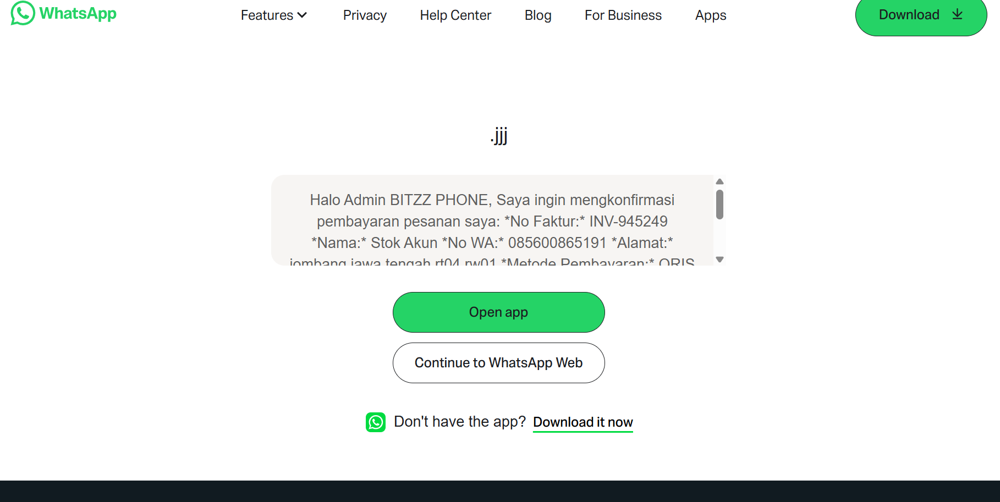

### 6. Dashboard Admin
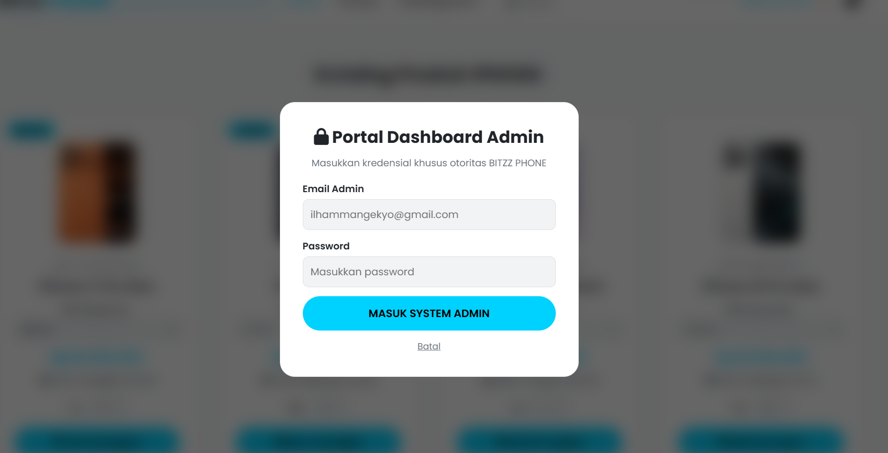
Portal tersembunyi bagi pemilik toko untuk mengelola operasional.
* **Manajemen Stok:**
** 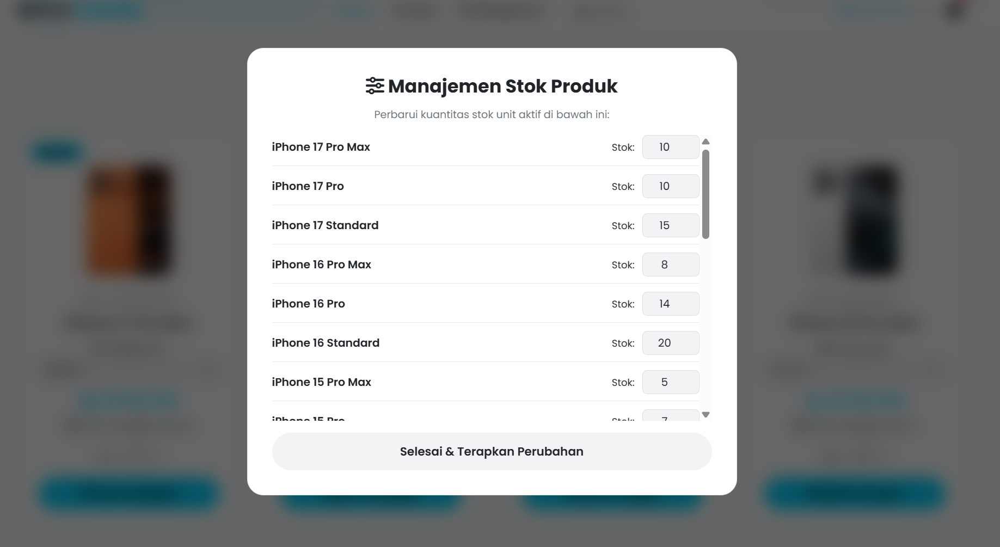
*   Admin dapat mengubah jumlah stok (*quantity*) setiap varian produk secara *real-time*.
* **Sinkronisasi LocalStorage:** Perubahan stok langsung tersimpan di *browser*, sehingga stok yang tampil di halaman pelanggan selalu *up-to-date*.
### 7. Tampilan Di Hp
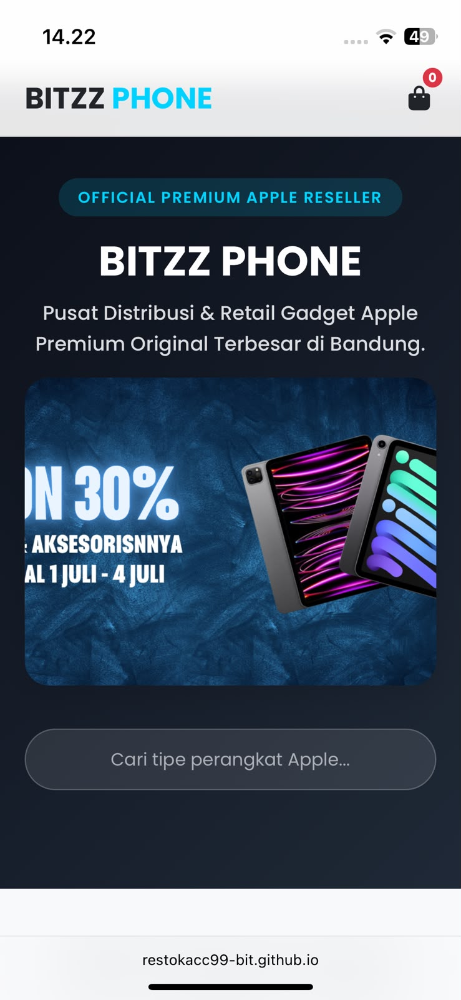
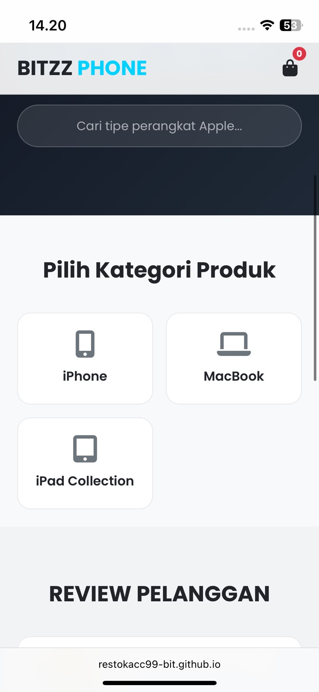
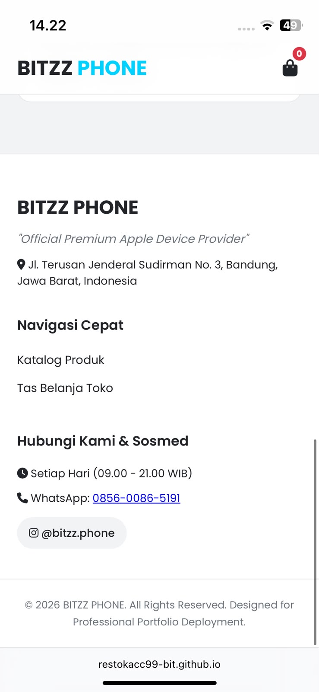
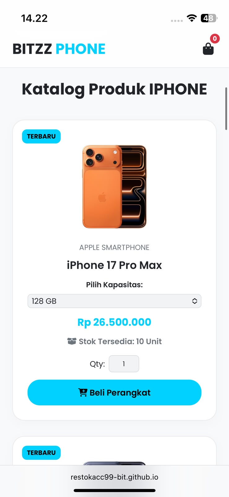
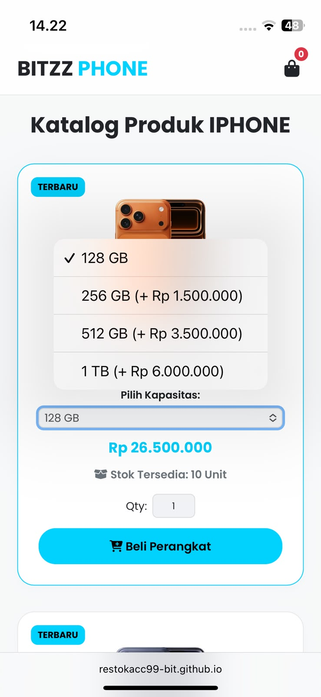
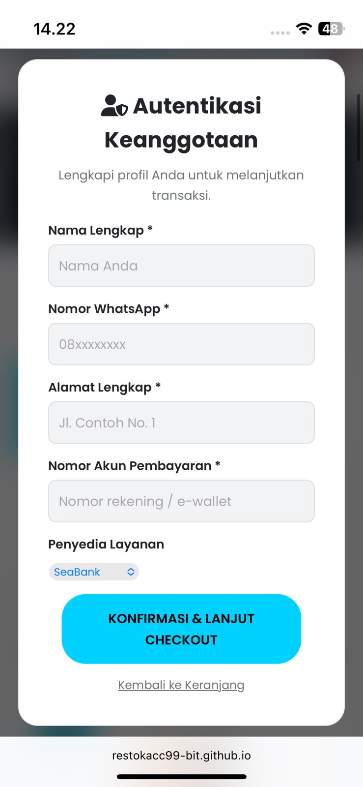
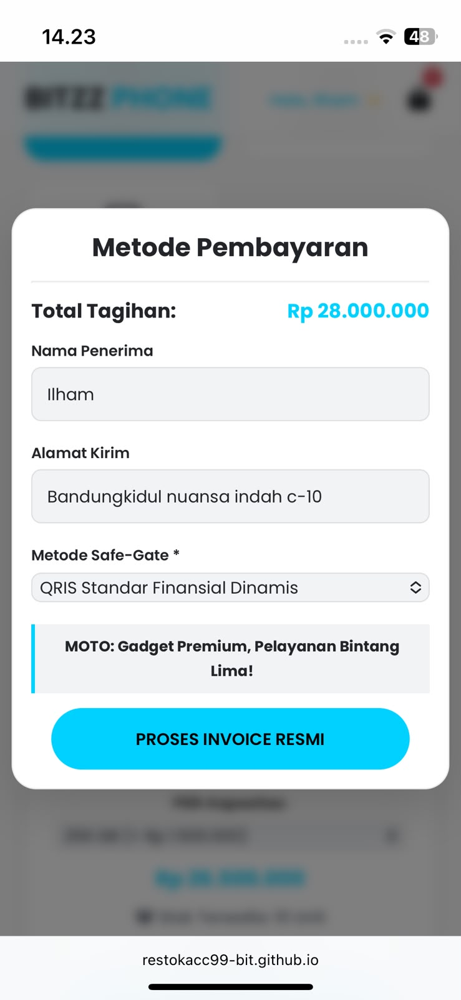
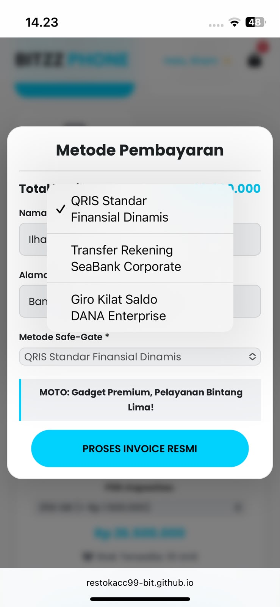
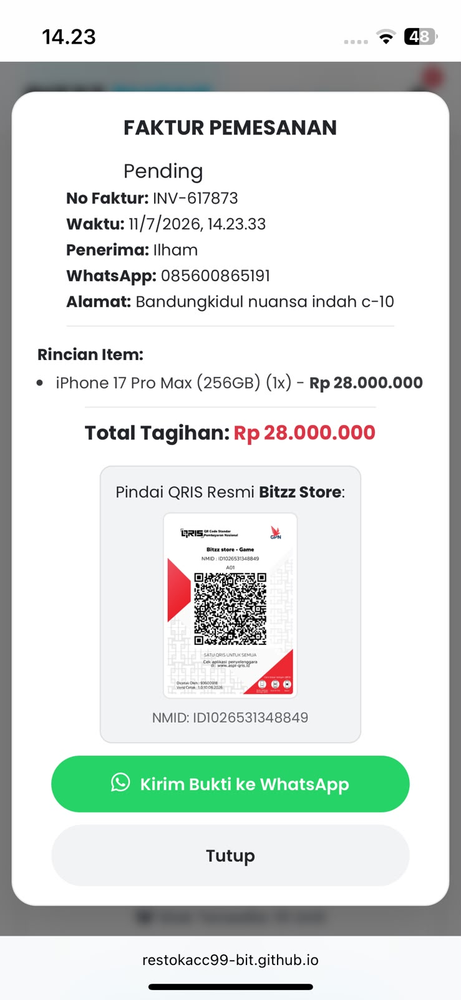
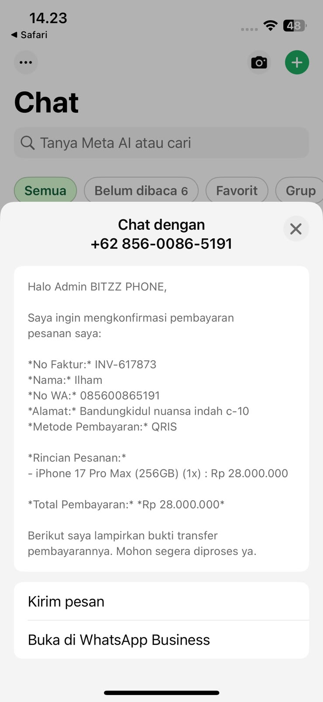

---

## 🛠️ Teknologi yang Digunakan

* **Struktur & Tampilan:** HTML5 & CSS3 (Vanilla)
* **Logika Sistem:** JavaScript (ES6)
* **Manajemen Data:** Web Storage API (`localStorage`)
* **Styling Tambahan:** Auto Light/Dark Mode (menyesuaikan tema *device* pengguna).
* **Ikonografi & Tipografi:** FontAwesome 6.5.1 & Google Fonts (Poppins)

---

## ⚙️ Cara Instalasi & Penggunaan (Lokal)

1. **Clone atau Unduh Repository**
   Unduh seluruh file proyek ini ke komputer Anda.
2. **Struktur Direktori**
   Pastikan folder Anda memiliki struktur standar proyek ini:
   - `index.html` 
   - `css/style.css` 
   - `js/script.js` 
   - `image/` (Pastikan aset gambar promosi dan produk ada di sini)
3. **Jalankan Aplikasi**
   Cukup klik dua kali file `index.html` menggunakan browser. Tidak memerlukan *server local* karena menggunakan *Client-Side Rendering*.

---

## 🔐 Akses Dasbor Admin (Demo)

Untuk mendemonstrasikan pembaruan stok produk, klik tombol **Admin** pada menu navigasi atas. Gunakan kredensial berikut:
* **Email Admin:** ilhammangekyo@gmail.com
* **Password:** Ilham191107

---
*Dibuat untuk keperluan Portofolio Web Development | Hak Cipta © 2026 BITZZ PHONE*
